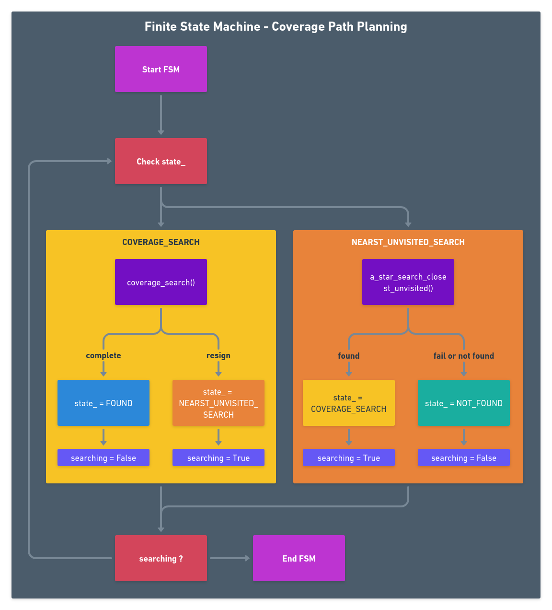
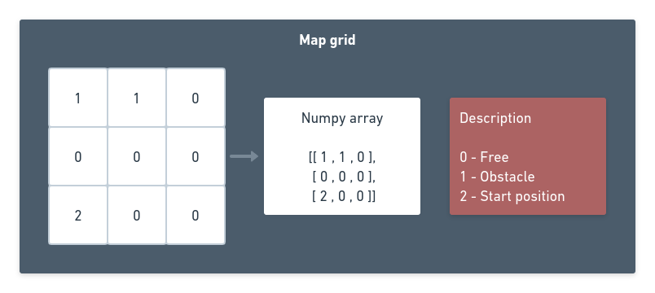
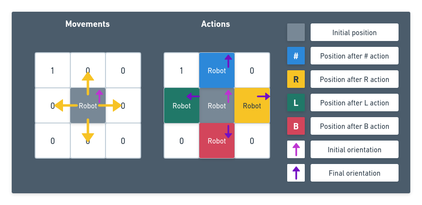
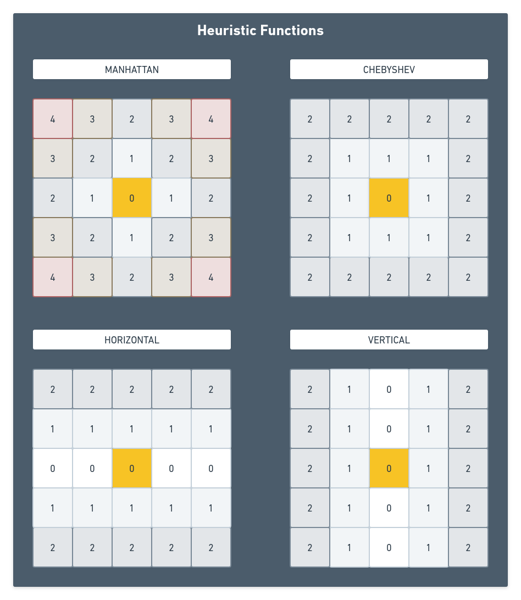
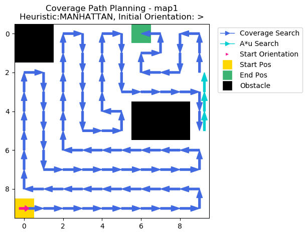
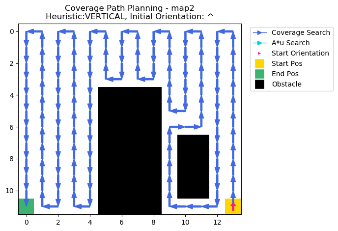
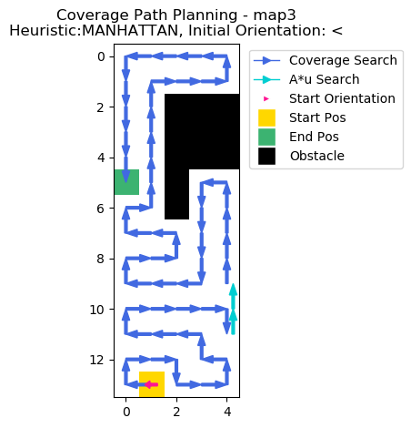
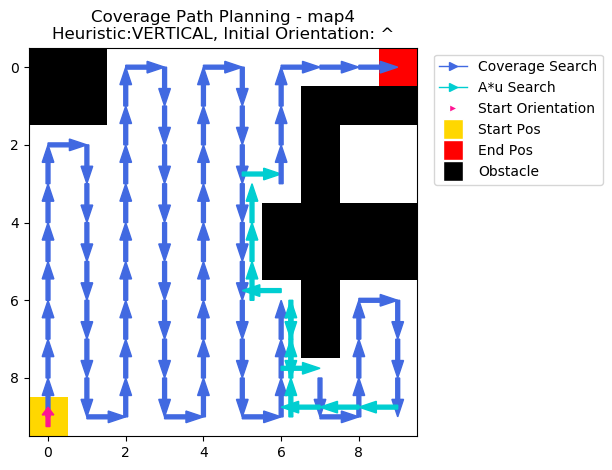

# coverage-path-planning

A coverage path planning algorithm that combines multiple search algorithms to find a full coverage trajectory with the lowest cost.

# Dependencies

This project was built and was run on Ubuntu 20.04 LTS. The following dependencies/packages are required:

- Python3 (3.8.10 used)
    - numpy (v1.17.4 used)
    - optional (used only in `coverage_test.py`):
        - matplotlib(v3.1.2 used)
        - tabulate (v0.8.9 used)

# Install

Clone this repository

```
https://github.com/rodriguesrenato/coverage-path-planning.git
```

# Usage

The coverage tests can be executed by running the following command in the terminal, on the `coverage-path-planning` folder:

```bash
python3 coverage_test.py
```

# Challenge

Given a NxM matrix, where free areas are marked with 0, obstacles with 1 and the starting point with 2, find a trajectory that passes through all the free squares with the lowest number of steps. At each step the robot can move to an adjacent (touching sides) free square. The discretisation of the grids is assumed to be equal to the width of the robot that will navigate through the space.

The answer should list the coordinates of the squares it goes through in order from the starting point, essentially the path to be taken by the robot. In addition, the code should include a simple visualisation to verify the results. A file containing the three areas the algorithm must be able to cope with is provided.

# Solution

The coverage planning solution was developed in the `CoveragePlanner` class, supported by two Enum classes `PlannerStatus` and `HeuristicType`

A finite state machine approach was chosen to handle switching between search algorithm and make solution more modular for future improvements. It runs until find or not a path to complete coverage the map.



The map given was previously pre processed into a numpy array, which is loaded at the test begining. 



A CoverageSearch class is instantiate by passing the map and it will hold the informations computed by the search.

A simple model of movement between position was chosen to guide the development of search algorithms:



- Each grid cell is a position
- The `robot` can be at a single cell,on a specific orientation: `x`,`y` and `orientation`
- The `robot` can perform `movements` to move from the current cell to adjacent cells

```python
    # Possible movements in x and y axis
        self.movement = [[-1,  0],  # up
                         [0, -1],    # left
                         [1,  0],    # down
                         [0,  1]]    # right
```

- There is a sequence of actions that can be performed by the robot, and each action is dependent of the robot current orientation and it has a associated cost. This approach was chosen because drive backwards tends to be more 'expensive' than just continue going forward.

```py
# Possible actions performed by the robot
        self.action = [-1, 0, 1, 2]
        self.action_name = ['R', '#', 'L', 'B']  # Right,Forward,Left,Backwards
        self.action_cost = [.2, .1, .2, .4]
```

Two search algorithm are implemented: "coverage search" and "closest unvisited search", based on "A* search" algorithm. Both algorithm return a standarized message containing:

1. If search completes the full coverage of the map.
3. The trajectory portion found by the current search.
4. The resulted coverage map, which is a matrix that comprises all visited positions and obstacles at the current moment.
4. Total cost of the tracjectory found.
5. Total steps done on the tracjectory found.

The trajectory is a list of:

1. Algorithm cost at given position
2. X coordinate
3. Y coordinate
4. Orientation (Based on movement actions)
5. Action that was done **before** arrive at this position
6. Action that will be done **after** arrive at this position
7. Lastest PlannerStatus at this position

The accumulated trajectory is stored on a class attribute, so that it can be used during or after the search.

The heuristic functions, used by each search algorithm, are described below:



## Policy Map

The policy maps is the *readable* map containing the given trajectory.

The next action to be performed by the robot at position is placed on each map position:

```py
self.action_name = ['R', '#', 'L', 'B']  # Right,Forward,Left,Backwards
```

Here is the Policy map generated by a Coverage search of `map1` and `Vertical Heuristic`:

```
[XXXXXX ,XXXXXX , R     , R     , R     , R     , L     , L     , L     , L     ]
[XXXXXX ,XXXXXX , #     , #     , #     , #     , #     , #     , #     , #     ]
[ R     , R     , #     , #     , #     , #     , #     , #     , #     , #     ]
[ #     , #     , #     , #     , #     , #     , @END  , R     , R     , #     ]
[ #     , #     , #     , #     , #     , #     ,XXXXXX ,XXXXXX ,XXXXXX , #     ]
[ #     , #     , #     , #     , #     , #     ,XXXXXX ,XXXXXX ,XXXXXX , #@CS  ]
[ #     , #     , #     , #     , #     , #     , R     , R     , R     , R#    ]
[ #     , #     , #     , #     , #     , #     , #     , #     , #     , ##    ]
[ #     , #     , #     , #     , #     , #     , #     , #     , #     , ##    ]
[ #@STA , L     , L     , L     , L     , L     , L     , L     , L     , B@A*  ]
```

The map obstacles are shown as `XXXXXX`.

The initial position has the `@STA` annotation. Before the `@` char is the action that will be performed at this position, which is a going forward action.

At position `[2,0]`, the roobot face an obstacle and the resulting action is `R`:to turn right and go 1 step forward.

At position `[9,9]`, the robot can't find any unvisited position around it, so it changes the seach to the `a_star_unvisited_seach` to find the closest unvisited position. An annotation `@A*` is placed at this position to indicate that change in seach algorithm.

The robot had to perform an `B` action, which is a 180 degree turn and go forward one step. 

The `[8,9]` position has two action labeled. The first `#` correspond to the fist action done at this position, and the second `#` correspond to the section action done at this position (made by the A*).

At position `[5,9]`, the A* seach trajectory is completed, so a `@CS` annotation is placed to indicate that a coverage search is going to be performed again.

at position `[3,6]`, there is no more unvisited positions, so a `@END` is placed on the map.

# Results

The following test was configured to test a list of maps and all possible heuristics and initial orientations for the `coverage search`.

coverage_test.py
```python
maps =  ["map1", "map2", "map3", "map4"]
cp_heuristics = [HeuristicType.VERTICAL,
                 HeuristicType.HORIZONTAL, HeuristicType.CHEBYSHEV, HeuristicType.MANHATTAN]
orientations = [0, 1, 2, 3]
```

The iterations are summarized for each map in a table, ordered by the number of steps and the total cost for break ties.

Here is the results for each map:

## Map1 results



```
Map tested: map1
+------------+-------------+--------+-------+-------+
| Heuristic  | Orientation | Found? | Steps | Cost  |
+------------+-------------+--------+-------+-------+
| MANHATTAN  |      >      |  True  |  91   | 12.00 |
| MANHATTAN  |      v      |  True  |  91   | 12.10 |
|  VERTICAL  |      ^      |  True  |  92   | 11.90 |
|  VERTICAL  |      <      |  True  |  92   | 12.00 |
|  VERTICAL  |      >      |  True  |  92   | 12.00 |
|  VERTICAL  |      v      |  True  |  92   | 12.20 |
| HORIZONTAL |      >      |  True  |  93   | 11.70 |
| HORIZONTAL |      ^      |  True  |  93   | 11.80 |
| HORIZONTAL |      v      |  True  |  93   | 11.80 |
| HORIZONTAL |      <      |  True  |  93   | 12.00 |
| MANHATTAN  |      ^      |  True  |  93   | 12.20 |
| MANHATTAN  |      <      |  True  |  93   | 12.30 |
| CHEBYSHEV  |      ^      |  True  |  97   | 14.00 |
| CHEBYSHEV  |      <      |  True  |  97   | 14.10 |
| CHEBYSHEV  |      >      |  True  |  97   | 14.20 |
| CHEBYSHEV  |      v      |  True  |  97   | 14.30 |
+------------+-------------+--------+-------+-------+
[print_policy_map] Policy Map:

[XXXXXX ,XXXXXX , R     , R     , R     , R     , @END  , L     , L     , L     ]
[XXXXXX ,XXXXXX , #     , #     , #     , #     , R     , L     , #     , #     ]
[ R     , R     , #     , #     , #     , #     , R     , #     , R     , #     ]
[ #     , #     , #     , #     , #     , L     , #     , #     , #     , R#    ]
[ #     , #     , #     , #     , R     , L     ,XXXXXX ,XXXXXX ,XXXXXX , ##    ]
[ #     , #     , #     , L     , #     , L     ,XXXXXX ,XXXXXX ,XXXXXX , B     ]
[ #     , #     , R     , #     , #     , #     , #     , #     , #     , L     ]
[ #     , L     , #     , #     , #     , #     , #     , #     , #     , L     ]
[ R     , #     , #     , #     , #     , #     , #     , #     , #     , L     ]
[ #@STA , #     , #     , #     , #     , #     , #     , #     , #     , L     ]
```

## Map2 results



```
Map tested: map2
+------------+-------------+--------+-------+-------+
| Heuristic  | Orientation | Found? | Steps | Cost  |
+------------+-------------+--------+-------+-------+
|  VERTICAL  |      ^      |  True  |  127  | 15.50 |
|  VERTICAL  |      <      |  True  |  127  | 15.60 |
|  VERTICAL  |      >      |  True  |  127  | 15.60 |
|  VERTICAL  |      v      |  True  |  127  | 15.80 |
| HORIZONTAL |      <      |  True  |  127  | 16.10 |
| HORIZONTAL |      ^      |  True  |  127  | 16.20 |
| HORIZONTAL |      v      |  True  |  127  | 16.20 |
| HORIZONTAL |      >      |  True  |  127  | 16.40 |
| MANHATTAN  |      ^      |  True  |  131  | 16.40 |
| MANHATTAN  |      >      |  True  |  131  | 16.50 |
| MANHATTAN  |      <      |  True  |  135  | 16.50 |
| MANHATTAN  |      v      |  True  |  135  | 16.60 |
| CHEBYSHEV  |      <      |  True  |  135  | 18.20 |
| CHEBYSHEV  |      v      |  True  |  135  | 18.30 |
| CHEBYSHEV  |      ^      |  True  |  139  | 19.20 |
| CHEBYSHEV  |      >      |  True  |  139  | 19.30 |
+------------+-------------+--------+-------+-------+
[print_policy_map] Policy Map:

[ L     , L     , L     , L     , L     , L     , L     , L     , L     , L     , L     , L     , L     , L     ]
[ #     , #     , #     , #     , #     , #     , #     , #     , #     , #     , #     , #     , #     , #     ]
[ #     , #     , #     , #     , #     , #     , #     , #     , #     , #     , #     , #     , #     , #     ]
[ #     , #     , #     , #     , #     , R     , R     , R     , R     , #     , #     , #     , #     , #     ]
[ #     , #     , #     , #     , #     ,XXXXXX ,XXXXXX ,XXXXXX ,XXXXXX , #     , #     , #     , #     , #     ]
[ #     , #     , #     , #     , #     ,XXXXXX ,XXXXXX ,XXXXXX ,XXXXXX , R     , R     , #     , #     , #     ]
[ #     , #     , #     , #     , #     ,XXXXXX ,XXXXXX ,XXXXXX ,XXXXXX , R     , #     , L     , #     , #     ]
[ #     , #     , #     , #     , #     ,XXXXXX ,XXXXXX ,XXXXXX ,XXXXXX , #     ,XXXXXX ,XXXXXX , #     , #     ]
[ #     , #     , #     , #     , #     ,XXXXXX ,XXXXXX ,XXXXXX ,XXXXXX , #     ,XXXXXX ,XXXXXX , #     , #     ]
[ #     , #     , #     , #     , #     ,XXXXXX ,XXXXXX ,XXXXXX ,XXXXXX , #     ,XXXXXX ,XXXXXX , #     , #     ]
[ #     , #     , #     , #     , #     ,XXXXXX ,XXXXXX ,XXXXXX ,XXXXXX , #     ,XXXXXX ,XXXXXX , #     , #     ]
[ @END  , R     , R     , R     , R     ,XXXXXX ,XXXXXX ,XXXXXX ,XXXXXX , R     , #     , #     , R     , #@STA ]
```

## Map3 results



```
Map tested: map3
+------------+-------------+--------+-------+-------+
| Heuristic  | Orientation | Found? | Steps | Cost  |
+------------+-------------+--------+-------+-------+
| MANHATTAN  |      <      |  True  |  59   | 8.70  |
| MANHATTAN  |      v      |  True  |  59   | 8.80  |
| MANHATTAN  |      ^      |  True  |  63   | 8.30  |
| HORIZONTAL |      >      |  True  |  64   | 10.20 |
| HORIZONTAL |      ^      |  True  |  64   | 10.30 |
| HORIZONTAL |      <      |  True  |  64   | 11.00 |
| HORIZONTAL |      v      |  True  |  64   | 11.10 |
|  VERTICAL  |      ^      |  True  |  67   | 9.60  |
|  VERTICAL  |      <      |  True  |  67   | 9.70  |
|  VERTICAL  |      >      |  True  |  67   | 9.70  |
|  VERTICAL  |      v      |  True  |  67   | 9.90  |
| CHEBYSHEV  |      >      |  True  |  68   | 10.60 |
| MANHATTAN  |      >      |  True  |  70   | 9.80  |
| CHEBYSHEV  |      <      |  True  |  71   | 11.40 |
| CHEBYSHEV  |      v      |  True  |  71   | 11.50 |
| CHEBYSHEV  |      ^      |  True  |  74   | 12.40 |
+------------+-------------+--------+-------+-------+
[print_policy_map] Policy Map:

[ L     , #     , #     , #     , L     ]
[ #     , R     , #     , #     , L     ]
[ #     , #     ,XXXXXX ,XXXXXX ,XXXXXX ]
[ #     , #     ,XXXXXX ,XXXXXX ,XXXXXX ]
[ #     , #     ,XXXXXX ,XXXXXX ,XXXXXX ]
[ @END  , #     ,XXXXXX , L     , L     ]
[ R     , L     ,XXXXXX , #     , #     ]
[ R     , #     , L     , #     , #     ]
[ R     , #     , L     , #     , #     ]
[ R     , #     , #     , R     , #     ]
[ R     , #     , #     , #     , R#    ]
[ R     , #     , #     , L     , B     ]
[ R     , #     , R     , R     , L     ]
[ R     , #@STA , L     , #     , L     ]
```

## Map4 results



```
Map tested: map4
+------------+-------------+--------+-------+-------+
| Heuristic  | Orientation | Found? | Steps | Cost  |
+------------+-------------+--------+-------+-------+
|  VERTICAL  |      ^      | False  |  88   | 11.60 |
|  VERTICAL  |      <      | False  |  88   | 11.70 |
|  VERTICAL  |      >      | False  |  88   | 11.70 |
|  VERTICAL  |      v      | False  |  88   | 11.90 |
| CHEBYSHEV  |      >      | False  |  88   | 13.20 |
| CHEBYSHEV  |      v      | False  |  88   | 13.30 |
| MANHATTAN  |      >      | False  |  91   | 12.30 |
| MANHATTAN  |      v      | False  |  91   | 12.40 |
| MANHATTAN  |      ^      | False  |  93   | 12.50 |
| MANHATTAN  |      <      | False  |  93   | 12.60 |
| CHEBYSHEV  |      ^      | False  |  94   | 15.40 |
| CHEBYSHEV  |      <      | False  |  94   | 15.50 |
| HORIZONTAL |      >      | False  |  95   | 13.10 |
| HORIZONTAL |      ^      | False  |  95   | 13.20 |
| HORIZONTAL |      v      | False  |  95   | 13.20 |
| HORIZONTAL |      <      | False  |  95   | 13.40 |
+------------+-------------+--------+-------+-------+
[print_policy_map] Policy Map:

[XXXXXX ,XXXXXX , R     , R     , R     , R     , R     , #     , #     , @END  ]
[XXXXXX ,XXXXXX , #     , #     , #     , #     , #     ,XXXXXX ,XXXXXX ,XXXXXX ]
[ R     , R     , #     , #     , #     , #     , #     ,XXXXXX ,       ,       ]
[ #     , #     , #     , #     , #     , #R    , L     ,XXXXXX ,       ,       ]
[ #     , #     , #     , #     , #     , ##    ,XXXXXX ,XXXXXX ,XXXXXX ,XXXXXX ]
[ #     , #     , #     , #     , #     , ##    ,XXXXXX ,XXXXXX ,XXXXXX ,XXXXXX ]
[ #     , #     , #     , #     , #     , #R    , BL    ,XXXXXX , R     , R     ]
[ #     , #     , #     , #     , #     , #     , ###   ,XXXXXX , #     , #     ]
[ #     , #     , #     , #     , #     , #     , #L#   , R     , #     , #     ]
[ #@STA , L     , L     , L     , L     , L     , LR    , L#    , L#    , R     ]
```

## Results for map1, with detailed output

After running the `coverage_test.py`, with `test_show_each_result` set `True`, here is an example of the full output when running for the "map1":

```
Iteration[map:map1, cp:VERTICAL]
[show_results] Presenting the current searching results:

[show_results] Final status: FOUND
[show_results] Total steps: 92
[show_results] Total cost: 11.90
[print_policy_map] Policy Map:

[XXXXXX ,XXXXXX , R     , R     , R     , R     , L     , L     , L     , L     ]
[XXXXXX ,XXXXXX , #     , #     , #     , #     , #     , #     , #     , #     ]
[ R     , R     , #     , #     , #     , #     , #     , #     , #     , #     ]
[ #     , #     , #     , #     , #     , #     , @END  , R     , R     , #     ]
[ #     , #     , #     , #     , #     , #     ,XXXXXX ,XXXXXX ,XXXXXX , #     ]
[ #     , #     , #     , #     , #     , #     ,XXXXXX ,XXXXXX ,XXXXXX , #@CS  ]
[ #     , #     , #     , #     , #     , #     , R     , R     , R     , R#    ]
[ #     , #     , #     , #     , #     , #     , #     , #     , #     , ##    ]
[ #     , #     , #     , #     , #     , #     , #     , #     , #     , ##    ]
[ #@STA , L     , L     , L     , L     , L     , L     , L     , L     , B@A*  ]


Iteration[map:map1, cp:HORIZONTAL]
[show_results] Presenting the current searching results:

[show_results] Final status: FOUND
[show_results] Total steps: 93
[show_results] Total cost: 11.80
[print_policy_map] Policy Map:

[XXXXXX ,XXXXXX , @END  , #     , #     , #     , #     , #     , #     , L     ]
[XXXXXX ,XXXXXX , R@CS  , #     , #     , #     , #     , #     , #     , L     ]
[ B@A*  , ##    , #L    , #     , #     , #     , #     , #     , #     , L@CS  ]
[ R     , #     , #     , #     , #     , #     , #     , #     , #     , R#    ]
[ R     , #     , #     , #     , #     , L     ,XXXXXX ,XXXXXX ,XXXXXX , ##    ]
[ R     , #     , #     , #     , #     , L     ,XXXXXX ,XXXXXX ,XXXXXX , B@A*  ]
[ R     , #     , #     , #     , #     , #     , #     , #     , #     , L     ]
[ R     , #     , #     , #     , #     , #     , #     , #     , #     , L     ]
[ R     , #     , #     , #     , #     , #     , #     , #     , #     , L     ]
[ R@STA , #     , #     , #     , #     , #     , #     , #     , #     , L     ]


Iteration[map:map1, cp:CHEBYSHEV]
[show_results] Presenting the current searching results:

[show_results] Final status: FOUND
[show_results] Total steps: 97
[show_results] Total cost: 14.00
[print_policy_map] Policy Map:

[XXXXXX ,XXXXXX , L     , #@CS  , R#    , ##    , ##    , ##    , ##    , B@A*  ]
[XXXXXX ,XXXXXX , L     , R     , #     , L     , #     , #     , #     , L     ]
[ L     , #     , #     , R     , #     , #     , R     , #     , #     , L     ]
[ L     , #     , #     , @END  , R     , R     , R     , #     , #     , L     ]
[ R     , #     , #     , #     , #     , R     ,XXXXXX ,XXXXXX ,XXXXXX , #     ]
[ R     , #     , #     , #     , L     , #     ,XXXXXX ,XXXXXX ,XXXXXX , #@CS  ]
[ R     , #     , #     , R     , #     , #     , R     , R     , R     , R#    ]
[ R     , #     , L     , #     , #     , #     , #     , #     , #     , ##    ]
[ R     , R     , #     , #     , #     , #     , #     , #     , #     , ##    ]
[ #@STA , L     , L     , L     , L     , L     , L     , L     , L     , B@A*  ]

Iteration[map:map1, cp:MANHATTAN]
[show_results] Presenting the current searching results:

[show_results] Final status: FOUND
[show_results] Total steps: 93
[show_results] Total cost: 12.20
[print_policy_map] Policy Map:

[XXXXXX ,XXXXXX , R     , R     , R     , R     , @END  , L     , L     , L     ]
[XXXXXX ,XXXXXX , #     , #     , #     , #     , R     , L     , #     , #     ]
[ R     , R     , #     , #     , #     , #     , R     , #     , R     , #@CS  ]
[ #     , #     , #     , #     , #     , #R    , #@CS  , #     , #     , R#    ]
[ #     , #     , #     , #     , #     , ##    ,XXXXXX ,XXXXXX ,XXXXXX , ##    ]
[ #     , #     , #     , #     , #     , B@A*  ,XXXXXX ,XXXXXX ,XXXXXX , B@A*  ]
[ #     , #     , #     , #     , R     , #     , #     , #     , #     , L     ]
[ #     , #     , #     , L     , #     , #     , #     , #     , #     , L     ]
[ #     , #     , R     , #     , #     , #     , #     , #     , #     , L     ]
[ #@STA , L     , #     , #     , #     , #     , #     , #     , #     , L     ]

```

At the end, it is shown the summary of tests, ordered by the number of test in ascending order

```
Map tested: map1
+------------+-------------+--------+-------+-------+
| Heuristic  | Orientation | Found? | Steps | Cost  |
+------------+-------------+--------+-------+-------+
| MANHATTAN  |      >      |  True  |  91   | 12.00 |
| MANHATTAN  |      v      |  True  |  91   | 12.10 |
|  VERTICAL  |      ^      |  True  |  92   | 11.90 |
|  VERTICAL  |      <      |  True  |  92   | 12.00 |
|  VERTICAL  |      >      |  True  |  92   | 12.00 |
|  VERTICAL  |      v      |  True  |  92   | 12.20 |
| HORIZONTAL |      >      |  True  |  93   | 11.70 |
| HORIZONTAL |      ^      |  True  |  93   | 11.80 |
| HORIZONTAL |      v      |  True  |  93   | 11.80 |
| HORIZONTAL |      <      |  True  |  93   | 12.00 |
| MANHATTAN  |      ^      |  True  |  93   | 12.20 |
| MANHATTAN  |      <      |  True  |  93   | 12.30 |
| CHEBYSHEV  |      ^      |  True  |  97   | 14.00 |
| CHEBYSHEV  |      <      |  True  |  97   | 14.10 |
| CHEBYSHEV  |      >      |  True  |  97   | 14.20 |
| CHEBYSHEV  |      v      |  True  |  97   | 14.30 |
+------------+-------------+--------+-------+-------+
[print_policy_map] Policy Map:

[XXXXXX ,XXXXXX , R     , R     , R     , R     , @END  , L     , L     , L     ]
[XXXXXX ,XXXXXX , #     , #     , #     , #     , R     , L     , #     , #     ]
[ R     , R     , #     , #     , #     , #     , R     , #     , R     , #     ]
[ #     , #     , #     , #     , #     , L     , #     , #     , #     , R#    ]
[ #     , #     , #     , #     , R     , L     ,XXXXXX ,XXXXXX ,XXXXXX , ##    ]
[ #     , #     , #     , L     , #     , L     ,XXXXXX ,XXXXXX ,XXXXXX , B     ]
[ #     , #     , R     , #     , #     , #     , #     , #     , #     , L     ]
[ #     , L     , #     , #     , #     , #     , #     , #     , #     , L     ]
[ R     , #     , #     , #     , #     , #     , #     , #     , #     , L     ]
[ #@STA , #     , #     , #     , #     , #     , #     , #     , #     , L     ]

List of coordinates of the best path: [map:map1, initial orientation: > (3), coverage path Heuristic:MANHATTAN]
[[9, 0], [9, 1], [9, 2], [9, 3], [9, 4], [9, 5], [9, 6], [9, 7], [9, 8], [9, 9], [8, 9], [8, 8], [8, 7], [8, 6], [8, 5], [8, 4], [8, 3], [8, 2], [8, 1], [8, 0], [7, 0], [6, 0], [5, 0], [4, 0], [3, 0], [2, 0], [2, 1], [3, 1], [4, 1], [5, 1], [6, 1], [7, 1], [7, 2], [7, 3], [7, 4], [7, 5], [7, 6], [7, 7], [7, 8], [7, 9], [6, 9], [6, 8], [6, 7], [6, 6], [6, 5], [6, 4], [6, 3], [6, 2], [5, 2], [4, 2], [3, 2], [2, 2], [1, 2], [0, 2], [0, 3], [1, 3], [2, 3], [3, 3], [4, 3], [5, 3], [5, 4], [5, 5], [4, 5], [4, 4], [3, 4], [2, 4], [1, 4], [0, 4], [0, 5], [1, 5], [2, 5], [3, 5], [3, 6], [3, 7], [3, 8], [3, 9], [4, 9], [5, 9], [4, 9], [3, 9], [2, 9], [1, 9], [0, 9], [0, 8], [1, 8], [2, 8], [2, 7], [2, 6], [1, 6], [1, 7], [0, 7], [0, 6]]
```

The final result is: The Map1, run by a Coverage search with `MANHATTAN` Heuristic and initial orientation `>`, did a complete coverage successfully with `91` steps.

# Code Structure

## CoveragePlanner

```
CoveragePlanner()
    |
    | # Finite State machine functions
    |
    |- compute()
    |- compute_non_blocking()
    |
    |  # Prepare to start searching functions
    |
    |- start()
    |
    |  # Search functions and helper functions
    |
    |- coverage_search()
    |- a_star_search_closest_unvisited()
    |- check_full_coverage()
    |- get_start_position()
    |
    |  # Heuristic generation functions
    |
    |- create_heuristic()
    |- create_manhattan_heuristic()
    |- create_chebyshev_heuristic()
    |- create_horizontal_heuristic()
    |- create_vertical_heuristic()
    |
    |  # Trajectory helper functions
    |
    |- append_trajectory()
    |- calculate_trajectory_cost()
    |- get_xy_trajectory()
    |
    | # Return and present results
    |
    |- result()
    |- show_results()
    |
    | # Printing helper functions
    |
    |- print_trajectory()
    |- print_map()
    |- print_policy_map()
    '- printd()
```

## PlannerStatus

An Enum class that has all the Finite State Machine states.

```python
class PlannerStatus(Enum):
    STANDBY = auto()
    COVERAGE_SEARCH = auto()
    NEARST_UNVISITED_SEARCH = auto()
    FOUND = auto()
    NOT_FOUND = auto()
```

## HeuristicType

An Enum class that holds the implemented heuristic types.

```python
class HeuristicType(Enum):
    MANHATTAN = auto()
    CHEBYSHEV = auto()
    VERTICAL = auto()
    HORIZONTAL = auto()
```

# Stategy

- Understand the problem
- Check for previous solution that I've worked with
    - Udacity nanodegree programs: A* search, dynamic programming, path planning on Self driving Cars.
    - Academic papers of Coverage Path Planning (on `docs` folder)
- Draf the first solution diagram and strategies
- Define first standards (variables, class structure, functions responses)
- Prototype and test individual approaches
- Evaluate results
- Build the main code structure on a finite state machine
- Prototype, test and evaluation
- code clean and optmization after a successfull result
- optimize
- Improve documentation

# Next Features to be Implemented

- A function to read the raw map given
- Dynamic computation of the best heuristic at each coverage searching step

# License

The contents of this repository are covered under the MIT License.

# References

Papers that were used in the process of understanding the problem and get inpiration to develop the solution, are placed at `docs` folder